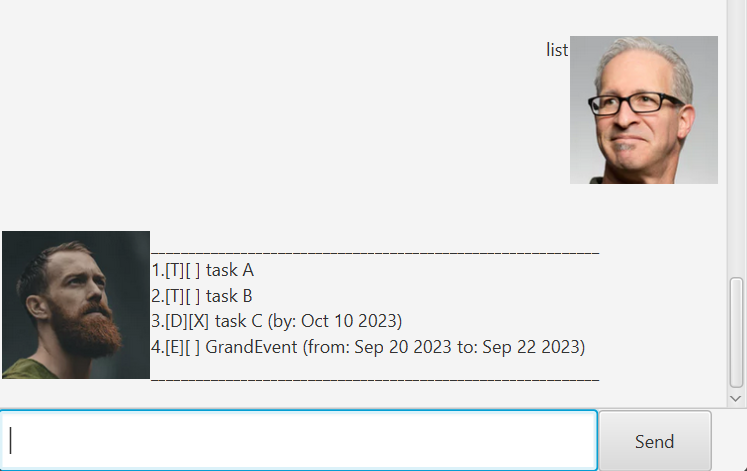
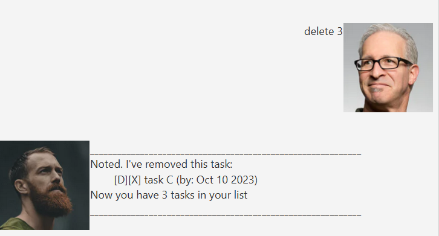
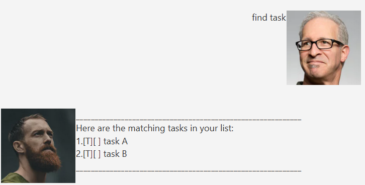

# Mathan ChatBot's User Guide
Mathan ChatBot is a **Desktop App** for storing and accessing tasks, events and deadlines.

## Features 
Here's a list of commands you can use in the chatbot:
- [List down all tasks: `list`](#list-down-all-tasks--list)
- [Create new todo task: `todo [Name]`](#create-new-todo-task--todo-name)
- [Create new deadline: `deadline [Name] /by [Date]`](#create-new-deadline--deadline-name-by-date)
- [Create new event: `event [Name] /from [Date] /to [Date]`](#create-new-event--event-name-from-date-to-date)
- [Mark/unmark tasks: `mark [taskNum]`/`unmark [taskNum]`](#markunmark-tasks--mark-tasknum--unmark-tasknum)
- [Delete a task: `delete [taskNum]`](#delete-a-task--delete-tasknum)
- [Find a task: `find [Name]`](#find-a-task--find-name)
- [Sort event/deadline chronologically: `sort event`/`sort deadline`](#sort-eventdeadline-chronologically--sort-event--sort-deadline)
- [Exit the chatbot: `bye`](#exit-the-chatbot--bye)
### List down all tasks: `list`
Lists the tasks in the order they were added,
whether they are marked or unmarked,
and the dates (if any)
  
Here's a sample output:

### Create new todo task: `todo [Name]`
Adds a new todo task to the list.
  
Here's an example output:

### Create new deadline: `deadline [Name] /by [Date]`
Follow the format above exactly with the date in the format `yyyy-MM-dd`
to create a valid deadline task

Here's an example output:

### Create new event: `event [Name] /from [Date] /to [Date]`
Follow the format above exactly with the dates in the format `yyyy-MM-dd`
to create a valid event

Here's an example output:

### Mark/unmark tasks: `mark [taskNum]`/`unmark [taskNum]`
marks and unmarks the checkbox next to task name in list function,
to indicate whether task has been completed.

> [!NOTE]
> Highlights information that users should take into account, even when skimming.
> [!NOTE]
> Note that the taskNum is the index of the task in the list function.

Here's an example output:

### Delete a task: `delete [taskNum]`
Deletes a task from the list.
> [!NOTE]
> Note that the taskNum is the index of the task in the list function.
> The taskNum is recomputed for all other tasks after deleting one task.

Here's an example output:

### Find a task: `find [Name]`
Searches for tasks based on its name. `[Name]` may also contain only a part of the task name.

Here's an example output:

### Sort event/deadline chronologically: `sort event`/`sort deadline`
Sorts deadlines based on when its due and events from its start date.

Here's an example output:

### Exit the chatbot: `bye`
Exits the chatbot and stops taking in new user input.

Here's an example output:

